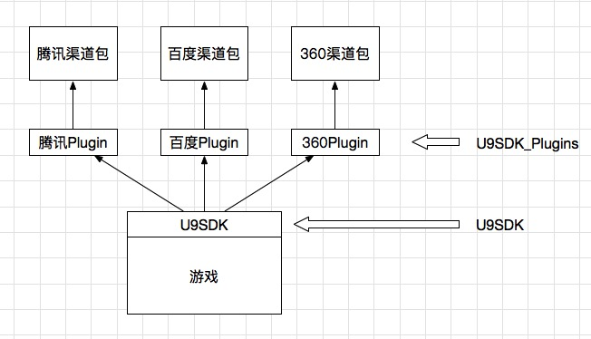
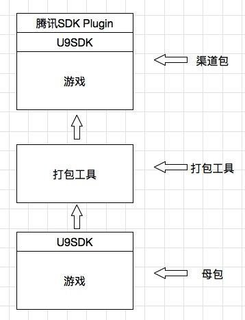
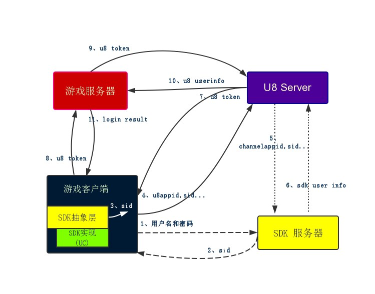
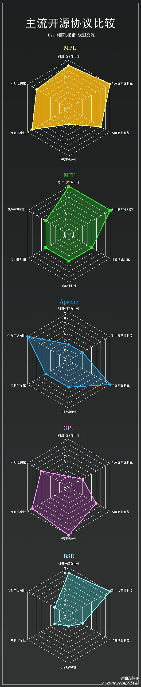

#Hello U9SDK
## 概述
U9SDK 是一款完全免费并开源的第三方SDK接入工具，由某匿名网友付费购得某开源SDK接入工具后，重新整理并重新完整开源，目前仅支持在Windows系统下制作Android渠道包.

由于涉及到的业务逻辑复杂，级涉及众多不同的平台系统，所以U9SDK整体采用了较多语言，包括：
* Android平台：抽象层框架采用java开发；
* Android平台：打包工具采用python开发，同时支持python2.7和python3.4版本；
* Android平台：SDK接入工程采用java开发；
* U8Server: 采用J2EE框架(Struts2+Spring3+Hibernate3)开发；
* Demo：支持Unity3D和Cocos2dx平台，分别采用C#和C++开发；

## 结构
### U9SDK
[U9SDK](https://github.com/u9sdk/U9SDK): <https://github.com/u9sdk/U9SDK>

该项目为U9SDK的框架核心部分，其实也就是一套抽象的接口层，用户需要将该层接入到游戏之中，在后期制作渠道包时，会通过脚本将该抽象接口层中的所需接口进行具体的实现，以达到实现渠道SDK接口API功能的目的；

### U9SDK_Plugins
[U9SDK_Plugins](https://github.com/u9sdk/U9SDK_Plugins): <https://github.com/u9sdk/U9SDK_Plugins>

前面讲过用户在对游戏接入过程时，只接入的抽象的接口层，这个接口层不包含任何的具体渠道SDK实现，打包的时候需要将具体的渠道SDK放入渠道包内，这个工程项目就是需要把所有的渠道SDK制作成相应的插件，以便在渠道包内部供U9SDK调用，目前该项目仅包含腾讯MSDK的实现范例；

### U9SDKPackage
[U9SDKPackage_Win](https://github.com/u9sdk/U9SDKPackage): <https://github.com/u9sdk/U9SDKPackage>

集成前述的U9SDK后的包仅为母包，没有任何实际的渠道SDK，自然也无法实现渠道SDK的任何功能，该项目是将一个游戏母包生成多个子渠道包的工具，当前仅支持Android渠道包制作，使用时需要Python运行环境和Java运行环境；

### U9SDK_Server
[U9SDK_Server](https://github.com/u9sdk/U9SDK_Server): <https://github.com/u9sdk/U9SDK_Server>

U9Server是采用J2EE框架SSH2实现，主要实现了：

1. 游戏管理：查询游戏，创建游戏（同时生成游戏的唯一appID，appKey等），编辑游戏，删除游戏等功能；
2. 渠道商管理：查询渠道商，创建渠道商（设置该渠道商对应的登陆认证地址，支付回调地址等操作。），编辑渠道商，删除渠道商等功能；
3. 渠道管理：查询某个游戏的渠道，创建渠道（将指定的游戏和一个渠道商连接起来，同时生成渠道ID，配置该游戏对应该渠道的appID,appKey等信息），编辑渠道，删除渠道；
4. 登陆认证：完成各个游戏各个渠道的统一登陆认证功能；
5. 支付回调：支付之前获取订单号。所有第三方SDK的支付回调，然后将第三方支付回调以统一的格式返回给游戏服务器；

主要业务逻辑：

## license
本项目本着开源共享，解脱程序员，共同学习的精神，希望更大自由度的方便程序员们的使用与学习，在研究了众多开源协议后，决定采用MIT协议：

上图引用自：<http://www.oschina.net/news/27273/main-os-license-comparison>

该协议在“应用代码自由性”和“引用者商业利益”两个维度更加自由，也就是意味着本项目可以被任意fork、使用，甚至进行商业化改造，所有本用户开源的源码包括本人在内的所有公司、商业团体、组织机构、个人等不对其拥有版权和产权等任何权益，由于本产品借鉴了目前市面上的部分产品，故代码中包含了部分其他产品的名称，如有侵犯到请与本人联系(u9sdk@sina.com),如诺您能证明相关的侵权部分，我将会尽快删除或者修改相关代码。

## 社区
QQ讨论组：517855988